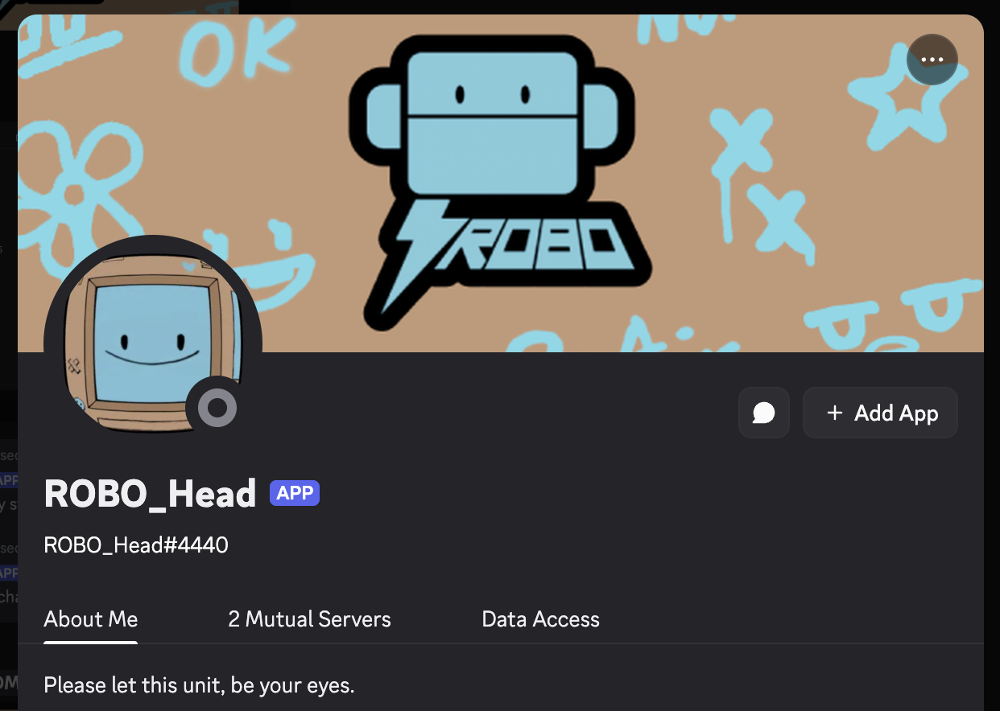
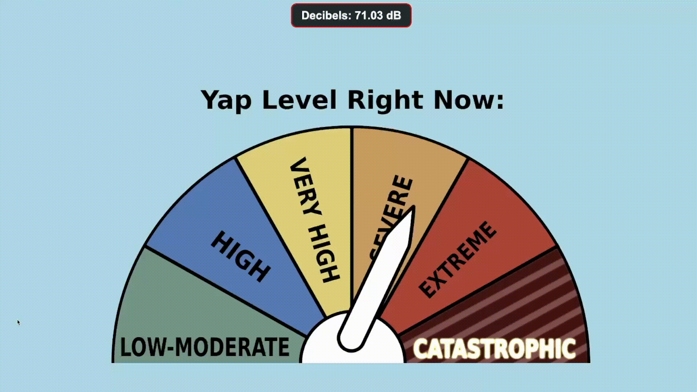
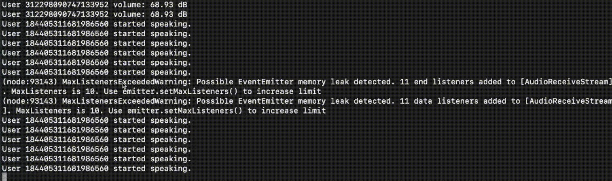
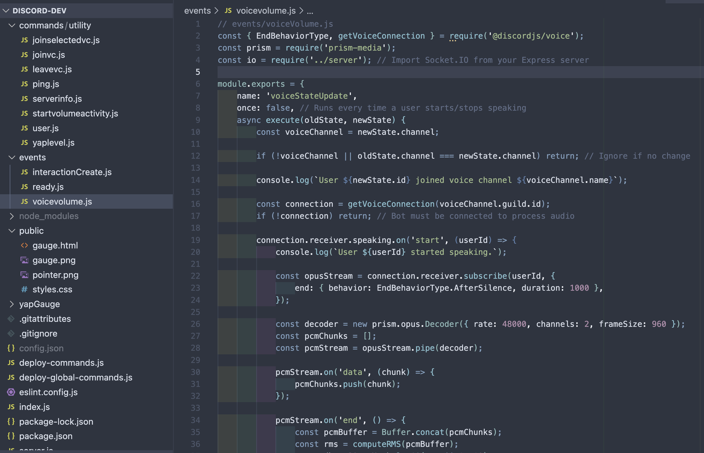

# ROBO_H3ad Discord Bot

A real-time voice activity monitoring Discord bot with custom activity display featuring live volume gauges and low-latency updates.



## Overview

ROBO_H3ad is a Discord bot that processes voice channel data in real-time and displays live audio levels through a custom bot activity. Built with Discord's API and WebSocket connections, it provides visual feedback of voice channel activity with extremely low latency (<100ms).

## Features

- **Real-time Voice Monitoring**: Captures and processes voice channel data as it happens
- **Custom Bot Activity**: Dynamic volume gauge displayed in the bot's Discord presence
- **Low Latency Updates**: Sub-100ms response time for live audio visualization
- **WebSocket Integration**: Efficient real-time data streaming using WebSocket protocol

## Demo

### Bot Activity in Action

*Live volume gauge responding to voice channel activity*

### Terminal Output

*Real-time logging and data processing*

## Tech Stack

- **Backend**: Discord.py, Python WebSocket
- **Frontend**: JavaScript, HTML/CSS
- **APIs**: Discord API (Voice, Gateway, Activities)
- **Protocols**: WebSocket for real-time communication

## Screenshots

### Code Architecture

*WebSocket handler and voice data processing logic*

## Getting Started

### Prerequisites
```bash
Python 3.8+
Discord Bot Token
Node.js (for frontend development)
```

### Installation

1. Clone the repository
```bash
git clone https://github.com/sheepapple/robo-h3ad.git
cd robo-h3ad
```

2. Install dependencies
```bash
pip install dependencies
npm install
```

3. Configure environment variables
```bash
cp .env.example .env
# Add your Discord bot token and configuration
```

4. Run the bot
```bash
python bot.py
```

## Configuration

Create a `.env` file with the following variables:
```env
DISCORD_TOKEN=your_bot_token_here
GUILD_ID=your_server_id
ACTIVITY_UPDATE_INTERVAL=100
```

## Architecture
```
├── server.js            # Main server
├── events/
│   ├── voicevolume.js        #Real-time audio data
│   └── interactionCreate.py   # WebSocket connection 
├── commands/utility/
│   ├── joinvs.js   # Joins Voice channel
│   ├── ...         # Assorted Commands
│   └── startvolumeactivity.py  # WebSocket activity
└── activity/
    ├── index.html         # Custom activity frontend
    └── index.css         # Activity styling
```

## How It Works

1. **Voice Connection**: Bot joins voice channel and establishes connection
2. **Data Capture**: WebSocket receives real-time audio level data from Discord
3. **Processing**: Audio levels are processed and normalized (<100ms latency)
4. **Display**: Custom activity updates with visual volume gauge
5. **Synchronization**: All connected clients see synchronized updates

## Performance

- **Latency**: <100ms from voice input to visual update
- **Update Rate**: Real-time, 10 updates per second
- **Concurrent Users**: Supports monitoring multiple voice channels simultaneously

## Contributing

Contributions are welcome! Please feel free to submit a Pull Request.

## Author

**Alex Mizrahi**
- GitHub: [@sheepapple](https://github.com/yourusername)
- Website: [sheepapple.net](https://sheepapple.net)

## Acknowledgments

- Discord.py community for excellent documentation
- Discord Developer Portal for API access
- Contributors and testers

---

**Note**: This bot requires Discord bot permissions for voice channel access. Make sure to configure appropriate permissions in the Discord Developer Portal.

## Support

For issues, questions, or suggestions, please [open an issue](https://github.com/sheepapple/robo-h3ad/issues) on GitHub.

**Last Updated**: February 2025
